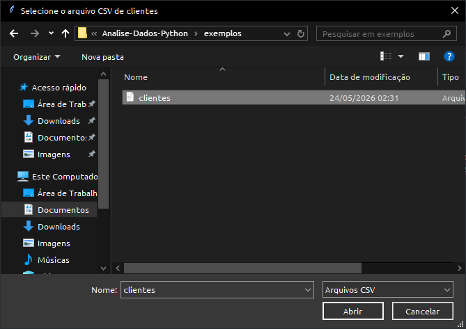
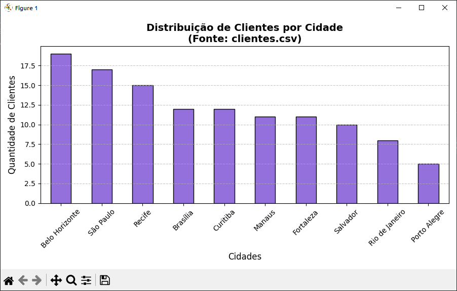

# 📊 Análise de Dados com Pandas, Matplotlib e Tkinter

Projeto desenvolvido em Python para realizar análise simples de dados a partir de arquivos CSV, utilizando Pandas para leitura e tratamento dos dados, Matplotlib para geração de gráficos e Tkinter para seleção do arquivo no computador.

---

## 📚 Sobre o Projeto

Este projeto permite ao usuário selecionar um arquivo CSV diretamente pelo explorador de arquivos do sistema. Após a seleção, o programa lê os dados, identifica a coluna de cidade e gera um gráfico de barras mostrando a distribuição de clientes por cidade.

A proposta é transformar dados tabulares em uma visualização gráfica simples, facilitando a interpretação das informações.

---

## 🚀 Tecnologias Utilizadas

* Python 3
* Pandas
* Matplotlib
* Tkinter
* Módulo `os`

---

## 🎯 Objetivos de Aprendizagem

Durante o desenvolvimento deste projeto foram praticados os seguintes conceitos:

* Leitura de arquivos CSV
* Manipulação de dados com Pandas
* Criação de gráficos com Matplotlib
* Interface de seleção de arquivos com Tkinter
* Tratamento de erros
* Validação de colunas em arquivos CSV
* Organização de código em funções
* Visualização de dados

---

## ✨ Funcionalidades

* 📂 Seleção de arquivo CSV pelo computador
* 📊 Leitura dos dados com Pandas
* 🏙️ Contagem de clientes por cidade
* 📈 Geração de gráfico de barras com Matplotlib
* 🔍 Verificação automática da coluna `Cidade`
* ⚠️ Tratamento de erros ao processar arquivos
* 🖥️ Alertas visuais com Tkinter

---

## 🌎 Aplicação no Mundo Real

Este tipo de projeto pode ser aplicado em situações reais onde é necessário transformar dados em informações visuais para facilitar a tomada de decisão.

Alguns exemplos de uso:

### 🛒 Comércio e Vendas

* Identificar cidades com maior número de clientes
* Entender a distribuição geográfica da base de consumidores
* Apoiar decisões sobre entregas, campanhas e expansão

### 🏢 Empresas

* Gerar relatórios rápidos a partir de planilhas
* Automatizar análises simples
* Visualizar dados sem abrir ferramentas mais complexas

### 📢 Marketing

* Entender onde estão os principais públicos
* Planejar campanhas por região
* Comparar concentração de clientes por localidade

### 📚 Estudos e Pesquisa

* Analisar dados coletados em formulários
* Criar gráficos para trabalhos acadêmicos
* Explorar bases de dados em formato CSV

---

## 📸 Screenshots

### 📂 Seleção do Arquivo CSV



---

### 📊 Gráfico Gerado



---

## ▶️ Como Executar

### 1. Clone o repositório

```bash
git clone <https://github.com/Lucksander/Analise-Dados-Python.git>
```

### 2. Instale as dependências

```bash
pip install pandas matplotlib
```

### 3. Execute o programa

```bash
dados_matplotlib.py
```

---

## 📁 Estrutura do Projeto

```text
analise-dados-matplotlib-python/
│
├── README.md
├── dados_matplotlib.py
│
├── exemplos/
│   └── clientes.csv
│
└── assets/
    ├── selecao_arquivo.png
    └── grafico_cidades.png
```

---

## 📄 Exemplo de Arquivo CSV

O arquivo CSV utilizado deve conter uma coluna chamada `Cidade`.

Exemplo:

```csv
Nome,Idade,Cidade,Renda
Lucas,29,Salvador,2500
Ana,31,Feira de Santana,3200
Carlos,27,Salvador,2800
Mariana,35,Lauro de Freitas,4100
```

---

## 📌 Resultado Esperado

Ao selecionar um arquivo CSV válido, o programa gera um gráfico de barras exibindo a quantidade de clientes por cidade.

Isso permite visualizar rapidamente quais cidades possuem maior concentração de registros no arquivo.

---

## 🔮 Melhorias Futuras

* Permitir escolha da coluna a ser analisada
* Exportar o gráfico como imagem
* Gerar relatório automático
* Adicionar filtros por cidade
* Criar interface gráfica completa
* Suporte a arquivos Excel
* Mais tipos de gráficos

---

## 📌 Aprendizados

Este projeto permitiu praticar conceitos importantes de análise e visualização de dados com Python, além de integrar bibliotecas diferentes para criar uma solução mais próxima de uma aplicação real.

Também reforçou a importância de validar dados, tratar erros e apresentar informações de forma visual e compreensível.

---

## 👨‍💻 Autor

Lucas Santos
Estudante de Análise e Desenvolvimento de Sistemas
